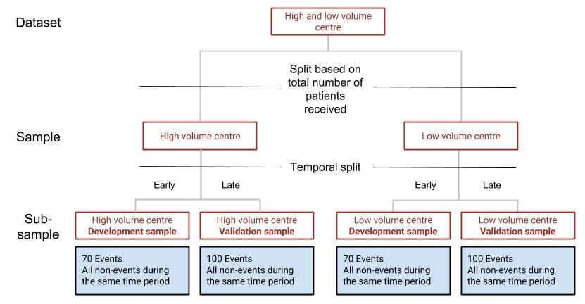

```{r setup, include=FALSE}
library(knitr)
knitr::opts_chunk$set(echo = TRUE)

## LOAD FUNCTIONS, ENVIROMENT AND TABLES
  ## Source functions
  source("functions/WorkTableCreator.R")
  ## Retrive original results
  results <- readRDS("output/original.results.Rds")
  ## Retrive data frame with compiled results
  result.tables.data.frame <- readRDS("result.tables.data.frame.Rds")
  ## Create table from result.tables.data.frame for ease of data retrival in document
  results.all.data <- WorkTableCreator(result.tables.data.frame)
  ## Set names in in retrival table for correct formatting
  names(results.all.data) <- c("high-volume", "low-volume", "metropolitan", "non-metropolitan", "multiple centres", "single centre")
  
## RESULTS
  ## Total patients and NA
  total.number.of.patients <- nrow(results$data.sets.before.imputations$multi.centre.vs.single.centre$multi.centre)
  total.number.of.na <- results$NA.info.sample$multi.centre.vs.single.centre$multi.centre$total.number.of.na
  ## Sample NA
  na.vector <- unlist(results$NA.info.sample)
  names(na.vector) <- c("high-volume", "high-volume", "low-volume", "low-volume", "metropolitan", "metropolitan", "non-metropolitan", "non-metropolitan", "multiple centres", "multiple centres", "single centre", "single centre")
  highest.percent.missing.number <- max(na.vector[na.vector<100])
  highest.percent.missing.name <- names((na.vector[na.vector == highest.percent.missing.number]))
  ## Variable NA
  number.variable.na <- max(results$NA.info.variable$multi.centre.vs.single.centre$multi.centre$number.of.na)
  percent.variable.na <- results$NA.info.variable$multi.centre.vs.single.centre$multi.centre$percentage[results$NA.info.variable$multi.centre.vs.single.centre$multi.centre$number.of.na == number.variable.na]
  name.variable.na <- row.names(results$NA.info.variable$multi.centre.vs.single.centre$multi.centre[results$NA.info.variable$multi.centre.vs.single.centre$multi.centre$number.of.na == number.variable.na,])
  gcs.na <- (results$NA.info.variable$multi.centre.vs.single.centre$multi.centre[row.names(results$NA.info.variable$multi.centre.vs.single.centre$multi.centre) == "ed_gcs_sum",])
  sbp.na <- (results$NA.info.variable$multi.centre.vs.single.centre$multi.centre[row.names(results$NA.info.variable$multi.centre.vs.single.centre$multi.centre) == "ed_sbp_value",])
  ## Development and validation
  ## Imputation data
  high.low.imp <- results$original.stats$Total.imputations[results$original.stats$Sample.name == "high.volume"]
  metro.non.imp <- results$original.stats$Total.imputations[results$original.stats$Sample.name == "metropolitan"]
  multi.single.imp <- results$original.stats$Total.imputations[results$original.stats$Sample.name == "multi.centre"]
  max.imp <- max(results$original.stats$Total.imputations)
  ## Validation data
  sorted.validation.mistriage <- sort(results.all.data[row.names(results.all.data) == "Validation.mistriage",], decreasing = FALSE)
  lowest.val.mistriage <- sorted.validation.mistriage[1]
  val.undertriage <- results.all.data["Validation.undertriage", colnames(lowest.val.mistriage)]
  val.overtriage <- results.all.data["Validation.overtriage", colnames(lowest.val.mistriage)]
  highest.val.mistriage <- sorted.validation.mistriage[6]
  ## Comparison
  ## Transfer data
  sorted.transfer.mistriage <- sort(results.all.data[row.names(results.all.data) == "Transfer.mistriage",], decreasing = FALSE)
  lowest.tran.mistriage <- sorted.transfer.mistriage[1]
  highest.tran.mistriage <- sorted.transfer.mistriage[6]
  ## Comparison data
  sorted.comp.mistriage <- sort(results.all.data[row.names(results.all.data) == "Transferred.mistriage.minus.buddy.local.mistriage",], decreasing = FALSE)
  highest.comp.mistriage <- sorted.comp.mistriage[6]
  worst.transfer <- results$original.stats[results$original.stats$Transferred.mistriage.minus.buddy.local.mistriage.median == max(results$original.stats$Transferred.mistriage.minus.buddy.local.mistriage.median),]

## DISCUSSION
  ## First paragraph
  UI.interval <- sub("\\).*", "", sub(".*\\(", "", format(highest.comp.mistriage)))
  UI.top.bot.list <- strsplit(UI.interval, split = " - ")
  UI.top.bot <- unlist(UI.top.bot.list)

## TABLE SETUP
  # Table 1 = Sample characteristics table
  high.low <- results$table.one.list$Characteristics_table_of_high.volume.vs.low.volume
  names(high.low) <- c("Characteristic", "Level", "High volume", "Low volume")
  met.nonmet <- results$table.one.list$Characteristics_table_of_metropolitan.vs.non.metropolitan
  names(met.nonmet) <- c("Characteristic", "Level", "Metropolitan", "Non-metropolitan")
  multi.single <- results$table.one.list$Characteristics_table_of_multi.centre.vs.single.centre
  names(multi.single) <- c("Characteristic", "Level", "Multiple centres", "Single centre")
   # Create complete table one (test)
   complete.table.one <- results$table.one.list$Characteristics_table_of_high.volume.vs.low.volume
   complete.table.one <- cbind(complete.table.one, results$table.one.list$Characteristics_table_of_metropolitan.vs.non.metropolitan$metropolitan)
   complete.table.one <- cbind(complete.table.one, results$table.one.list$Characteristics_table_of_metropolitan.vs.non.metropolitan$non.metropolitan)
   complete.table.one <- cbind(complete.table.one, results$table.one.list$Characteristics_table_of_multi.centre.vs.single.centre$multi.centre)
   complete.table.one <- cbind(complete.table.one, results$table.one.list$Characteristics_table_of_multi.centre.vs.single.centre$single.centre.11001)
   names(complete.table.one) <- c("characteristic", "level", "high volume", "low volume", "metropolitan", "non metropolitan", "multi centre", "single centre")
   complete.table.one$characteristic <- c("n", "Age", "Gender", "", "GCS", "SBP", "RR", "30DS", "", "ISS", "NISS", "ISS>15", "")
  # Table 2 = result.tables, cropped to only show validation
  table.2 <- results.all.data[1:3,]
  rownames(table.2) <- c("Mistriage", "Undertriage", "Overtriage")
   # Create complete table two (test) 
   complete.table.two <- results.all.data[1:3,]
   rownames(complete.table.two) <- c("mistriage", "undertriage", "overtriage")
  # Table 3 = Cropped to only show transfer
  table.3 <- results.all.data[4:6,]
  rownames(table.3) <- c("Mistriage", "Undertriage", "Overtriage")
  # Table 4 = Cropped to only show transfer differance
  table.4 <- results.all.data[7:9,]
  rownames(table.4) <- c("Mistriage", "Undertriage", "Overtriage")
```
---
abstract: |

  **Background:** Trauma results in approximately 3.8 million deaths annually. Clinical
  prediction models are often used for triage in early trauma care. Previous research has
  indicated that transferring these models between different settings might adversely affect 
  model performance.
  
  **Methods:** Patients aged 15 years or older who were registered between 2011 and
  2016 in the Swedish national trauma registry, SweTrau, were included. Three sets
  of data were created: high- and low-volume centres, metropolitan and
  non-metropolitan centres, and multiple and single centres. Clinical
  prediction models were developed using logistic regression in each data set 
  and transferred within sets. Model performance was evaluated in all data
  sets using the mistriage rate, undertriage rate and overtriage rate. Multiple
  imputation using chained equations was used to handle missing data. Model
  performance was reported as medians with the 95% uncertainty interval across
  imputed data sets.
  
  **Results:** A total of `r total.number.of.patients ` patients were included. The model
  validation mistriage rate ranged from `r lowest.val.mistriage` 
  to `r highest.val.mistriage`, and the transferred model
  mistriage rate ranged from `r lowest.tran.mistriage` to `r highest.tran.mistriage` 
  across all samples. Performance after transfer when compared to the receiving sample validation 
  performance resulted in substantial uncertainty in all samples. The worst performance after 
  transfer was found in the `r colnames(highest.comp.mistriage)` 
  sample, with a mistriage difference of `r highest.comp.mistriage`.
  
  **Conclusions:** In all samples, model transfer was associated with high 
  levels of uncertainty. Notably, transfer from the `r colnames(highest.comp.mistriage)` 
  sample to the other sample in the data set led to an increased mistriage
  rate, primarily due to increased overtriage. 
  
  **Keywords:** Trauma, Clinical prediction model, Transferability, Mistriage, Undertriage, Overtriage 
---

# Introduction
Trauma, defined as physical injuries to a host by outside objects [@RN63], 
accounts for approximately 458.5 million cases annually across the globe [@RN999] 
and an estimated 3.8 million deaths [@RN1; @RN21]. Each year, 9% of global 
deaths are the result of trauma, with the leading causes being road traffic accidents, 
suicide, and homicide. Predictions indicate that the incidence of these causes is 
likely to increase by 2030 [@RN42].

In a typical high-resource setting, the initial management of trauma is
performed on the scene by Emergency Medical Services
(EMS). Patient data and vital signs are transferred to the receiving hospital. 
This information is then evaluated using a system to determine
the level of trauma, prepare adequate resources [@RN43] and dictate whether a full
or limited trauma team is activated [@RN44].

Systems that determine the level of trauma during early trauma care can be based 
on clinical prediction models. Models differ in quality and characteristics but 
generally perform well at predicting survival [@RN45]. Many models are developed 
in a single, standardized context, such as a major trauma centre, but are then 
implemented in different contexts, such as non-trauma centres.

What is not fully understood is how this transfer affects model
performance. Previous research has shown that model performance in terms of
calibration can be adversely affected [@RN27]. However, the aforementioned
research studied model transfers between substantially different settings and
did not assess more clinically relevant performance measures, such as
misclassification.

In trauma, misclassification is often referred to as mistriage. Triage refers to
the classification of trauma severity as minor or major. Mistriage can be
subdivided into overtriage, which is the incorrect classification of a patient with minor
trauma as one with major trauma, or undertriage, which is the incorrect classification of a patient
with major trauma as one with minor trauma. Mistriage can ultimately lead to decreased patient 
survival and is also detrimental to patient care and the distribution of resources [@RN44]. 

Thus, the effect of model transfers between care contexts within a single healthcare system, 
as well as the effect of such transfers on mistriage, have not been studied and represent 
substantial knowledge gaps. The aim of this study was to assess how transfers 
of clinical prediction models for early trauma care between different care contexts 
within a single health system affect mistriage rates.
  
  
# Materials and methods
## Study design
A registry-based cohort study was conducted. Sweden has a nationally encompassing
trauma registry called SweTrau. SweTrau data were used to create
clinical prediction models, which were then transferred between different care contexts to
study the effects on mistriage. The study and analysis plans were made
publicly available before the research was undertaken [@RN59].

## Setting
In Sweden, trauma is the most common cause of death before 44 years of age, and 
10% of major trauma patients suffer some form of disability. 
The societal effects of trauma are substantial, with the loss
of days at work comparable to those lost from cardiovascular and malignant diseases
combined [@RN23].

Trauma care in Sweden is usually clearly defined in major
metropolitan areas: trauma patients are transported directly to a predesignated
hospital with specific trauma competency. In more rural parts of the
country, trauma patients are instead transported to the nearest hospital for
stabilization. Once stabilized, they may then be transported to a hospital with
more advanced trauma care capacity [@RN34]. Most hospitals in Sweden use some
system to categorize the level of trauma, usually
based on patient vital signs and the mechanism of injury, as reported by the EMS or as
registered in the emergency department [@RN90].

Today, 52 of the 55 Swedish hospitals record trauma cases in SweTrau. 
Currently, the registry includes 55 000 cases, and its use is encouraged for 
both academic research and local quality improvement initiatives [@RN28].

## Participants 
The eligibility criteria were adult patients aged 15 years or above registered 
in SweTrau between 2011 and 2016. The study aimed to assess adult trauma and not
paediatric trauma, which differs in physiology, triage and initial care
[@RN46]. The Swedish guidelines for trauma activation define children as 
individuals aged <15 years [@RN90].

## Variables
### Participant characteristics
To describe the patient cohort, we reported age, sex, Injury Severity Score (ISS)
and New ISS (NISS).

### Model predictors
The clinical prediction models used the following predictors on arrival
at the hospital: systolic blood pressure (SBP), respiratory rate (RR) and 
Glasgow coma scale (GCS). The rationale for using these three predictors 
is that they are part of multiple established clinical prediction models 
for early trauma care, such as the Revised Trauma Score [@RN35].

### Model outcome
The outcome used to develop the clinical prediction models was all-cause
mortality within 30 days of trauma.

### Study outcome
ISS > 15 was used as the gold standard to define trauma severity as major
trauma, and hence, patients with ISS ≤ 15 were considered to have minor trauma
[@RN36]. Overtriage was defined as the event when a clinical prediction model
classified a patient with ISS ≤ 15 as having major trauma, and undertriage was defined as the event
when a clinical prediction model classified a patient with ISS > 15 as having minor
trauma. The overtriage rate was defined as the number of overtriaged patients
divided by the total number of patients. The undertriage rate was defined as the number of
undertriaged patients divided by the total number of patients. The mistriage rate was defined as the
sum of the over- and undertriage rates.

## Data sources and measurements
Model predictors, outcome, participant characteristics and study outcome as
outlined above were all obtained from SweTrau. The method of measurement of the
model predictors is not specified in the registry entries. In Swedish emergency rooms,
patient parameters are usually obtained by a registered nurse or assistant nurse
and are assumed to be accurate.  Whether the patient is dead or alive 30 days
after trauma is manually entered into the registry by each respective
hospital. The NISS and ISS are calculated by hospital personnel
based on the patient’s injuries.

## Bias
Data analysis was conducted according to a prearranged analysis plan. The
analysis plan and statistical analysis code were finalised using simulated
data. These efforts were made to avoid confirmation bias. The analysis plan was
reviewed by an experienced statistician and programmer prior to implementation. 
Neither the outcome nor variables were blinded during analysis, which 
made a structured approach important to ensure objectivity.

## Study size
All patients matching the eligibility criteria were included. Four data sets were
used to study the transfer of clinical prediction models, with each data set
representing a different care context. The data sets and sample size considerations 
are outlined below.

## Quantitative variables
GCS was modelled as a continuous linear term, and SBP and RR were modelled using 
restricted cubic splines with four knots whenever possible, placed at equally spaced 
percentiles. When describing the participant characteristics, quantitative variables 
were presented as continuous. ISS was presented as dichotomous, using ISS > 15 as the cutoff.

## Statistical methods
### Data sets
The complete SweTrau cohort was split into three overlapping sets of data, each representing a 
plausible care context for model transfer. These data sets were further divided 
into samples as follows:

### Data set 1: High- and low-volume centres
Two samples were derived from the SweTrau cohort based on the number of patients. 
High-volume centres were those within the top quartile in terms of the number of 
patients received. The rest were low-volume centres.

### Data set 2: Metropolitan and non-metropolitan centres
This data set was also split into two samples: a metropolitan sample consisting of 
patients from greater Stockholm, greater Gothenburg and greater Malmö, as defined by 
Swedish statistics, and a second sample consisting of patients from non-metropolitan areas.

### Data set 3: Multiple and single centre data
In this data set, two samples were created. One centre with a large enough 
sample sizes to develop and validate a model was its own sample. The multiple centres 
sample consisted of the combined data from all centres.

A fourth dataset was initially created, consisting of individual centres that 
had large enough sample size to develop and validate a model. However, this 
data set was removed before analysis due to a lack of centres 
with a sufficiently large sample size.

### Development and validation sample
The samples in each data set were split into
two subsamples using a temporal split based on the date of trauma. The earlier
subsample was the development sample, and the later subsample was the validation
sample. The development sample contained 70 events (events being patients who
died within 30 days of the trauma) and all non-events (non-events being patients who
survived 30 days past the trauma) during the same time. The rationale for
including 70 events is that at least 10 events per free parameter were needed in
the logistic regression to obtain stable coefficient estimates [@RN30]. The
validation sample contained 100 events and at least 100 non-events,
which was suggested as the minimum number by Vergouwe in 2005 for external
validation samples [@RN37]. Figure 1 shows the development of the samples using 
the high- and low-volume centre data set as an example. The minimum sample sizes 
of the development and validation samples were 140 and 200, respectively. 
We performed analyses only on data sets for which all samples included at 
least the minimum sample size.

  
**Fig. 1: Sample development in the high- and low-volume centre data set.**  Initial 
split based on the number of patients. Temporal split made using the date of the trauma.

### Sequence of analysis
The programming language R was used for all analyses [@RN31], and all code has
been made publicly available [@RN59]. Analyses were performed in the sequence
of model development, model validation and finally model comparison. These steps
were repeated in each data set. Below, we use the transfer of a model from the
high-volume centre sample to the low-volume centre sample as an example to describe 
the complete procedure.

### Model development
In the model development step, a clinical prediction model was developed in the
high-volume centre development sample. The model was developed using logistic
regression. The dependent variable was all-cause mortality within 30 days of 
trauma, and the independent variables SBP, RR, and GCS were modelled as previously described. 
To avoid overfitting the model, a bootstrap procedure was used to estimate a linear 
shrinkage factor that was then applied to the model coefficients [@RN61]. The shrunk 
model was used to estimate the probability of all-cause 30-day mortality in the 
development sample. A grid search was performed across estimated probabilities in 
the development sample to identify the cutoff value that optimised overtriage while keeping 
undertriage at less than 5% [@RN39]. This cutoff value was then used to classify patients 
as having major or minor trauma.

### Model validation
In the model validation step, the model performance was assessed in the
high-volume centre validation sample and in the low-volume centre validation
sample. First, the model was used to estimate the probability of all-cause 30-day
mortality in each sample. Then, the probability cutoff value identified in the
development sample was applied to the validation samples, patients were
classified as having major or minor trauma, and the model performance was estimated.

### Model comparison
Finally, the difference in model performance
between the high- and low-volume centre validation samples was
calculated. Empirical bootstrapping was used to estimate the 95% confidence intervals
(CI) around the performance and the differences in the performance estimates. Both bootstrap
procedures used 1 000 bootstrap samples drawn with replacement of the same size
as the original samples. The three steps of model development, model validation,
and model comparison were repeated in all four sets of data.

### Performance measures
Model performance was assessed in terms of over-, under-, and mistriage rates as
defined above.

### Missing data
We used multiple imputation using chained equations (mice) to handle missing data [@RN41]. 
The number of imputations created for each data set was equal to the highest 
percentage of missing data in that data set. Quantitative variables were imputed 
using predictive mean matching, and qualitative variables were imputed using logistic 
regression. SBP and RR were transformed as restricted cubic splines before imputation. 
All analyses outlined above were then conducted separately in
each imputed dataset. We present the combined results as the median point
estimate across imputations along with an empirical bootstrap of the 25th and
75th percentiles across imputations, i.e. the lower bound of the presented
interval is the lower bound of a 95% CI of the 25th percentile, and the upper
bound is the upper bound of a 95% CI of the 75th percentile. This combined CI
was referred to as an uncertainty interval (UI) and was used to express the
added uncertainty associated with the imputation procedure to handle missing
data; as such, it is more conservative than a standard 95% CI.

## Ethical considerations
The study was approved by the regional ethics review board in Stockholm, Sweden. 
The ethics review numbers are 2015/426-31 and 2016/461-32. All patients in SweTrau 
received letters detailing their inclusion in the database and the possibility 
of their data being used for scientific purposes. It was assumed that the patients 
who consented to the use of their SweTrau data for research wanted to contribute to 
the improvement of care, and thus, by performing this study, the authors hope to 
honour their wishes.
  
  
# Results
We analysed data from `r total.number.of.patients ` trauma patients to
investigate the effects of transfer on clinical prediction models (Table 1). The
total number of missing observations across all variables was `r total.number.of.na ` 
in the entire study cohort. The sample with the highest
percentage of missing observations was the `r highest.percent.missing.name `
sample, with `r highest.percent.missing.number `% incomplete observations. The
variable with the highest number of missing values was the `r name.variable.na `,
with `r number.variable.na ` missing values, or `r round(percent.variable.na)`% of 
the total values for this variable. The percentages of missing values for the other 
model predictors were `r round(gcs.na$percentage)`% for GCS and `r round(sbp.na$percentage)`% 
for SBP.

**Table 1. Sample characteristics of multiple imputed data.** Data are presented as medians with interquartile range (IQR) or counts with %, as applicable.
```{r, echo = FALSE, results = "asis"} 
## Table 1
options(knitr.kable.NA = '')
kable(high.low, format = "markdown")
kable(met.nonmet, format = "markdown")
kable(multi.single, format = "markdown")
# kable(complete.table.one, format = "markdown")
``` 
GCS, Glasgow coma scale; SBP, systolic blood pressure; RR, respiratory rate; ISS, injury severity score; NISS, new injury severity score

## Development and validation
During model development, the number of imputations used for each data set was
`r high.low.imp`, `r metro.non.imp` and `r multi.single.imp` for the high- and
low-volume data set, the metropolitan and non-metropolitan data set, and the
multiple and single centre data set, respectively.
  
Table 2 shows the model validation performance. The model with the lowest validation
mistriage rate was the `r colnames(lowest.val.mistriage)` model, with a median
mistriage rate of `r lowest.val.mistriage`. The performance in terms of
undertriage and overtriage rate for the same model was `r val.undertriage` and
`r val.overtriage`, respectively. The worst validation performance (i.e. highest
mistriage rate) was found in the `r colnames(highest.val.mistriage)` sample, with
a model median mistriage rate of `r highest.val.mistriage`.
  
**Table 2. Model validation performance, i.e. performance when applied to the sample in which the model was created.** Data are presented as point estimates with 95% uncertainty intervals (95% UI).
```{r, echo = FALSE, results = "asis"} 
## Table 2
kable(table.2[,1:2], format = "markdown")
kable(table.2[,3:4], format = "markdown")
kable(table.2[,5:6], format = "markdown")
# kable(complete.table.two, format = "markdown")
```

## Comparison
Model performance after transfer was determined for each model after being transferred
to the other sample in the data set, in all data sets (Table 3). When
transferred, the model with the lowest mistriage rate was the `r colnames(lowest.tran.mistriage)` 
model, with a median mistriage rate of `r lowest.tran.mistriage`. The model with 
the highest mistriage rate after transfer was the `r colnames(highest.tran.mistriage)` model 
with a median mistriage rate of `r highest.tran.mistriage`.
  
**Table 3. Model transfer performance, i.e. performance when transferred to the other sample in the same data set.** Data are presented as point estimates with 95% uncertainty intervals (95% UI).  
```{r, echo = FALSE, results = "asis"} 
kable(table.3[,1:2], format = "markdown")
kable(table.3[,3:4], format = "markdown")
kable(table.3[,5:6], format = "markdown")
```  

Table 4 shows the transferred model performance when compared to the validation
performance in the sample receiving the transferred model.
The highest mistriage rate when compared to the receiving sample validation
model performance was found in the `r colnames(highest.comp.mistriage)` model,
with a median mistriage rate difference of `r highest.comp.mistriage`, meaning
this model performed worse when transferred to the other sample in the same data
set. In clinical terms, this model transfer means that among 100 trauma
patients, `r abs(worst.transfer$Transferred.mistriage.minus.buddy.local.mistriage.median) * 100` 
more patients would be wrongly classified as having major or minor trauma.
  
**Table 4. Comparison mistriage, i.e. sample validation performance subtracted from transferred performance.** Data are presented as point estimates with 95% uncertainty intervals (95% UI).  
```{r, echo = FALSE, results = "asis"} 
kable(table.4[,1:2], format = "markdown")
kable(table.4[,3:4], format = "markdown")
kable(table.4[,5:6], format = "markdown")
``` 
  
  
# Discussion
This study aimed to assess how transfers of clinical prediction models for early
trauma care between different contexts within a single health system affect
mistriage rates. In all data sets, model transfer between samples resulted in
substantial uncertainty in terms of its effect on model performance. When comparing the
transferred performance to the receiving sample validation performance, the
resulting differences also showed considerable uncertainty.

The most notable effects on model performance following model transfer were observed
after transferring the `r colnames(highest.comp.mistriage)` model. This transfer
resulted in an increase in the mistriage rate of 
`r substr(format(highest.comp.mistriage), 1, 5)`.  Mainly contributing to this was
a marked increase in overtriage.  For this transfer, the 95% UI ranged from 
`r UI.top.bot[1]` to `r UI.top.bot[2]`, indicating a high level of uncertainty, suggesting
that our findings are compatible with a `r UI.top.bot[1]` decrease to a 
`r UI.top.bot[2]` increase in mistriage. The negative 95% UI of `r UI.top.bot[1]`
would signify an improvement in model performance. The higher 95% UI of 
`r UI.top.bot[2]` would mean a marked increase in model mistriage compared to the
point estimate of `r substr(format(highest.comp.mistriage), 1, 5)`.

Due to centralized trauma care, non-metropolitan centres generally have fewer 
resources and less experience receiving trauma patients. They may rely 
on clinical prediction models more heavily for accurate trauma triage, and 
an increase in overtriage can lead to further strains on already limited 
resources. Increased undertriage could possibly lead to increased patient 
mortality.

Recognizing these risks and updating models accordingly could lead
to increased accuracy during trauma patient triage, potentially saving lives by
minimizing undertriage, and likely saving resources by minimizing overtriage. With
registries such as SweTrau, the analysis of model transfer could be performed
continuously to optimize the models currently in use and advise which model
transfers might be detrimental (or potentially beneficial).

The transfer of clinical prediction models in trauma care has not previously
been studied extensively. In 2016, Gerdin et al. found that model transfer
adversely affected model performance in terms of calibration but that this could
be improved by updating the model [@RN27]. This study did not examine model
performance in terms of calibration, nor were the effects of updating the
model explored.

External validation as the evaluation of a clinical prediction model in a
setting in which it was not originally developed has been studied more
extensively. Studies using simulated clinical prediction models based on
different predictors showed a decline in model performance when externally
validated [@RN60; @RN61]. A study from 2018 examining the external validity of
prediction models for coronary artery disease (CAD) [@RN62] showed that the models
significantly underestimated the probability of CAD. The combined results of
this study, the studies on model transfer and the studies on external validation
would suggest caution when transferring models.

## Strengths and limitations
### Strengths
The main strength of this study is that its design realistically reflects
potential model transfers: clinical prediction models for trauma are usually
developed in large metropolitan centres and then transferred as clinical
recommendations to minor non-metropolitan centres. The results should therefore
be of practical importance.

### Limitations
Originally, all single centres with a valid number of 
events were to constitute a data set, but only one centre provided a sufficient 
number of events, leading to the loss of the individual centres data set. 
This data set could have provided interesting results reflecting realistic 
situations.

This study used GCS, RR and SBP as predictors for 30-day
mortality. Additional predictors such as age and mechanism
of injury or newer predictors such as the shock index might increase model
performance. Furthermore, we used 30-day mortality as an outcome, recognizing
that late mortality, time in hospital, functional impairment, and morbidity are
also important outcomes in the context of trauma care.

The predetermined analysis plan was to be followed in a step-by-step fashion. 
Programming challenges and late-time code inclusions required a flexible approach 
to this analysis plan, sometimes with revisions of previous steps. This is not 
optimal, and efforts were made to not deviate in any major way. Using GitHub, 
all code was made public for inspection and to ensure reproducibility [@RN59].

## Conclusion
Model transfer resulted in large and varying levels of uncertainty in in terms of its effect
on mistriage. Therefore, model transfer can be unpredictable, potentially leading 
to increased mistriage but in some cases also to a decrease in mistriage. 
Noticeably, transfer of the `r colnames(highest.comp.mistriage)` model led to an 
increased mistriage of `r highest.comp.mistriage`. This observed effect was also 
associated with considerable uncertainty. Recognizing the limitations of this study, 
the authors believe that further studies are warranted due to the potential economic 
costs and patient consequences of poor model transfers.

  
# References
